### Kotlin 基本语法格式

```
fun main(args: Array<String>) {
    println("Hello World")
}
```

- “fun”表示函数声明，“main()”表示函数入口
- args是函数接收的参数名，Array＜String＞是参数的数据类型（字符串数组类型）
- “println（"Hello World"）”为函数的输出语句
- 每条语句可省略分号 ;
- “package（包）”管理文件
- 区分大小写
- 驼峰命名法
- 一个字符串不能分开在两行中书写
- “//”  单行注释
- 以符号 / * 开头，以符号 */ 结尾，多行注释
- / ** 开头，*/ 结尾，文档注释
- 多行注释“/ *…*/”中可以嵌套单行注释“//”。与Java程序不同的是，Kotlin程序中的多行注释“/ *…*/”中可以嵌套多行注释“/ *…*/”

### Kotlin 中的变量

- 可变变量 var  —— Java语言中的普通变量
- 不可变变量（只读变量） val —— Java语言中用final关键字修饰的常量
- var/val 变量名：数据类型
- 数值类型变量：数值型、字符型、布尔型、数组型、字符串型

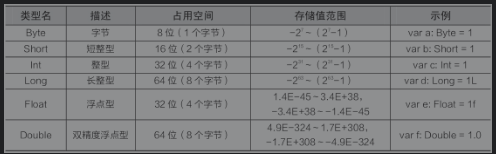

- 与Java不同的是，在Kotlin中Char类型的变量不能直接赋值为数字，必须使用单引号把数字括起来才可以进行赋值。

### Kotlin中的运算符、字符串

- +、-、*、=、＞

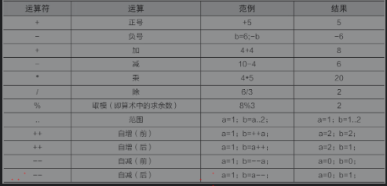

- 表达式的执行顺序是从左到右，1500/1000*1000 结果为 1000
- 在进行取模（%）运算时，运算结果的正负取决于被模数（%左边的数）的符号，与模数（%右边的数）的符号无关。例如（-1）%2=-1，而1%（-2）=1
- 在进行自增“++”和自减“--”的运算时，如果运算符“++”或“--”放在操作数的前面则是先进行自增或自减运算，再进行其他运算。反之，如果运算符放在操作数的后面则是先进行其他运算再进行自增或自减运算

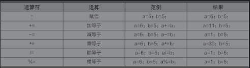

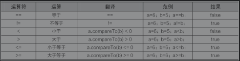

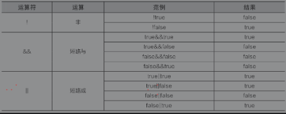

- 字符串是不可变的，字符串中的元素可以使用索引的形式进行访问：即“变量名+角标”的形式，如str[i]；也可以用for循环遍历字符串，如 for(c in str) println(c)
- first()、last()、get（index），分别用于查找字符串中的第1个元素、最后1个元素以及角标为index的元素

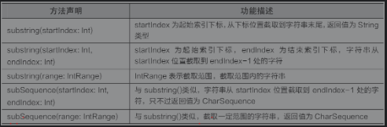

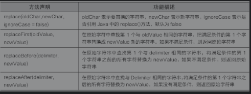

- split()函数进行字符串分隔
- trim()、trimEnd() 去空格

- 反斜杠“\”方式将字符进行转义

- \r：表示回车符，将光标定位到当前行的开头，不会跳到下一行。
- \n：表示换行符，换到下一行开头。• \t：表示制表符，将光标移动到下一个制表符的位置，类似在文档中用Tab键的效果。
- \b：表示退格符号，类似键盘上的Backspace键。
- \'：表示单引号字符，在Kotlin代码中单引号表示字符的开始和结束，如果直接写单引号字符（'），程序会认为前两个是一对，会报错，因此需要使用转义字符（\'）。
- \"：表示双引号字符，Kotlin中双引号表示字符串的开始和结束，包含在字符串中的双引号需要转义，比如""。
- \\：表示反斜杠字符，由于在Kotlin代码中的反斜杠（\）是转义字符，因此需要表示字面意义上的\，就需要使用双反斜杠（\\）。

- 原生字符串，使用3对引号（""""""）把所有字符括起来，有效地保证字符串中原有内容的输出，即使原生字符串中包含转义字符也不会被转义。

- 字符串模板表达式由 \$ {  变量名/函数/表达式 } 组成，也可以省略 {}，例如 “ $变量名”
- 在原生字符串中，使用模板表达式输出 \$ 需要使用 \$ { '$' }

### Kotlin中选择结构语句、循环结构语句的用法

- while ( 循环条件 ) { 执行语句 ... }

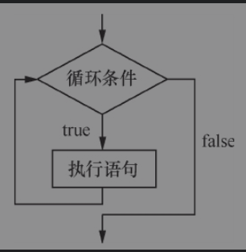

- do { 执行语句... } while ( 循环条件 ) —— 语句会无条件执行一次

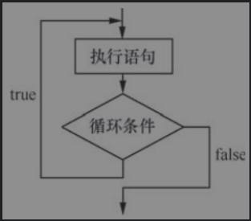

- for ( 循环对象 in 循环条件 ) { 执行语句 ... }
- 在使用for循环语句的过程中，如果for循环中只有一条执行语句，则可以去掉循环体的{}

- 调用者.forEach() { prinln("it = ${it}") } —— 调用者可以是数组或集合，it 表示数组中的元素

- 带角标的forEachIndexed语句：调用者.forEachIndexed() { index, it -> println("角标=\$index 元素=${it}") }

- break 出现在while循环语句中时，作用是跳出循环语句
- break语句出现在嵌套循环中的内层循环时，它只能跳出内层循环，如果想使用break语句跳出外层循环则需要对外层循环添加标记 loop@

- continue语句用在循环语句中，它的作用是终止本次循环，执行下一次循环
- 在嵌套循环语句中，continue语句后面也可以通过使用标记的方式结束本次外层循环，用法与break语句一样

### Kotlin 区间和数组

- 区间是通过rangeTo（other:Int）函数构成的区间表达式，也可以用“..”形式的操作符来表示 —— [ ]
- 函数until（to:Int）输出的区间不包含结尾元素 —— [ )

- downTo（to:Int）函数可以按照逆向顺序输出区间中的内容，该函数可以省略()并且在downTo后加上空格符，空格符后加上范围值 —— [ ]

- 使用 step（step:Int）函数来实现在循环中指定步长

- 数组使用 Array 表示，其中数值类型、布尔类型、字符类型、字符串类型都可以定义为数组

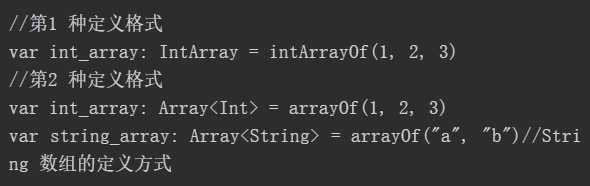

- 在Kotlin中，如果创建的数组对象没有被初始化，则当访问数组中的元素时，程序会报错并提示数组对象必须初始化
- 每个数组的索引都有一个范围，即0～size-1。在访问数组的元素时，索引不能超出这个范围，否则程序会报错

- 数组.set（角标,值）来修改数组元素
- indexOf() 方法来查找来查找数组元素

### Kotlin中变量类型转换、空值处理的操作方法

- 使用 is 操作符或 !is 反向操作符提前检测对象是否是特定类
- Any 类型类似于 Java 中的 Object 类型，表示任意类型
- 强制类型转换主要是通过 as 与 as? 操作符进行的
- 一般情况下，一个变量默认是非空类型。当某个变量的值可以为空时，必须在声明处的数据类型后添加“?”来标识该引用可为空
- 在使用“?.”调用可空变量的属性时，如果当前变量为空，则程序编译也不会报错，而是返回一个 null 值
- Kotlin 中提供了一个Elvis操作符（?:），通过Elvis操作符（?:）可以指定可空变量为null时，调用该变量中的成员方法或属性的返回值，其语法格式为“表达式?:表达式”
- 非空断言（!!.）可调用可空类型变量的成员方法或属性

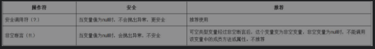

