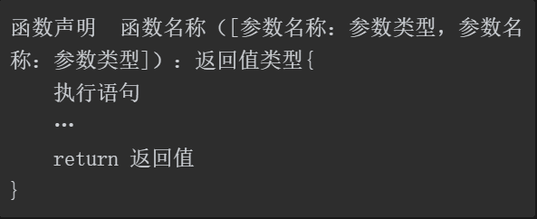
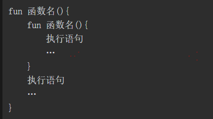
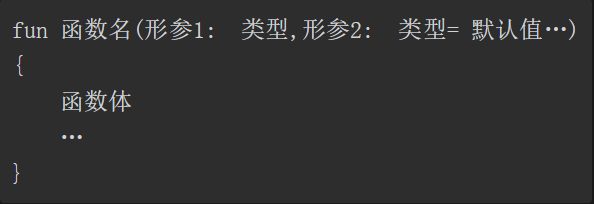
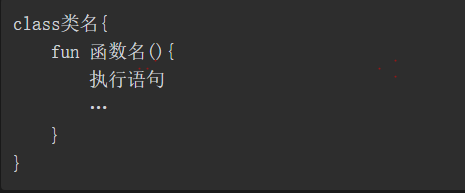

### Kotlin中函数的使用方法

- 函数的语法格式：

- 函数声明：Kotlin中的函数声明使用关键字fun
- 函数名称：每一个函数都有函数名称，方便在函数调用时使用
- 参数类型：用于限定调用函数时传入参数的数据类型
- 参数名称：是一个变量，用于接收调用函数时传入的数据
-  返回值类型：用于限定函数返回值的数据类型
- 返回值：被return语句返回的值，该值会返回给调用者
- 如果一个函数不返回任何类型的值，则它的返回值类型实际上是Unit（无类型），类似于Java中的void。当函数的返回值类型为Unit时，可以省略不写Unit
- 从参数的角度可分为有参函数和无参函数，从返回值的角度可分为有返回值的函数和无返回值的函数。即无参无返回值、无参有返回值、有参无返回值、有参有返回值。
- 单表达式函数：如果函数体中只有一行代码，则可以把包裹函数体的花括号{}替换为等号“=”，把函数体放在等号“=”的后面
- 具名参数，指在调用函数时显示指定形参的名称

- 形参：是在定义函数名和函数体时使用的参数，目的是用于接收调用该函数时传入的参数
- 实参：是在调用时传递给函数的参数
- 实参必须具有确定的值，以便把该值传递给形参，因此可提前用赋值、输入等方法使实参获取确定的值

- 默认参数：

- 当定义一个函数时，如果没有设置该函数的默认参数，则调用该函数时必须传递具体的实参。如果定义一个函数时，函数中设置有默认的参数，则调用该函数时可以不用传递具体实参，不传递实参的情况下，函数会使用默认参数。

- 可变参数通过vararg关键字标识，我们可以将其理解为数组，通常声明在形参列表中的最后位置，如果不声明在最后位置，那么可变参数后面的其他参数都需要通过命名参数的形式进行传递
- 在实参中传递数组时，需要使用“*”前缀操作符，意思是将数组展开，它只能展开数组，不能展开集合

Kotlin 中可变参数规则：
• 可变参数可以出现在参数列表的任意位置；
可变参数是通过关键字vararg来修饰；
• 可以以数组的形式使用可变参数的形参变量，实参中传递数组时，需要使用“*”前缀操作符。

Java 中可变参数规则：
• 可变参数只能出现在参数列表的最后；
• 用“…”代表可变参数，“…”位于变量类型与变量名称之间；
• 调用含有可变参数的函数时，编译器为该可变参数隐式创建一个数组，在函数体中以数组的形式访问可变参数。

###Kotlin中函数的分类

- 顶层函数：又称为包级别函数，可以直接放在某一个包中，可以独立存在
- 顶层函数在被调用时，如果在同一个包中，可直接调用，如果在不同的包中，需要导入对应的包。

- 成员函数：在类或对象内部定义

- 局部函数：在一个函数的内部定义另一个函数

- 递归函数：在函数体内部调用函数本身
- 尾递归函数：一个函数中所有递归调用都出现在函数的末尾
- 尾递归函数是一种特殊的递归函数，特殊之处在于该函数的调用出现在函数的末尾。通常情况下，尾递归函数一般用在连续求和、连续求差等程序中
- Kotlin中提供了一个tailrec修饰符来修饰尾递归函数，此时编译器会优化该尾递归函数，将尾递归函数转化为while循环，程序会快速高效地运行，并且无堆栈溢出的风险

- 函数重载一般是用在功能相同但参数不同的接口中
- 函数的重载与函数的返回值类型无关，只需要同时满足两个条件，一是函数名相同，二是参数个数或参数类型不相同即可
