### 面向对象的概念

- 面向对象是把解决的问题按照一定规则划分为多个独立的对象，然后通过调用对象的方法来解决问题
- 3大特性，分别为封装性、继承性和多态性
- 封装性是面向对象的核心思想，将对象的属性和行为封装起来，不需要让外界知道具体实现细节
- 继承性主要描述的是类与类之间的关系，通过继承，可以在无须重新编写原有类的情况下，对原有类的功能进行扩展
- 多态性指的是在程序中允许出现重名现象，它指在一个类中定义的属性和方法被其他类继承后，它们可以具有不同的数据类型或表现出不同的行为，这使得同一个属性和方法在不同的类中具有不同的语义

### 类与对象的关系

- 使用“class”关键字声明一个类
- 类是对象的抽象，它用于描述一组对象的共同特征和行为
- 成员变量用于描述对象的特征

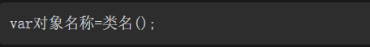

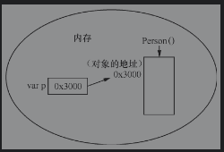

- 类的封装是指在定义一个类时，将类中的属性私有化，即使用private关键字来修饰，私有属性只能在它所在的类中被访问

- 构造函数是类的一个特殊成员，它会在类实例化对象时被自动调用
- 主构函数位于类头跟在类名之后，如果主构造函数没有任何注解或可见性修饰符（如public），constructor关键字可省略

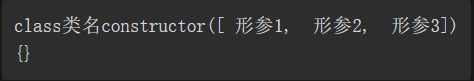

- 定义一个类时，如果没有显示指定主构函数，则Kotlin编译器会默认为其生成一个无参主构函数

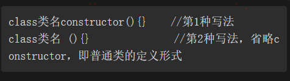

- 在主构函数中赋值时，通常使用init{}初始化代码块，专门用于属性的初始化工作
- Kotlin中提供了this关键字，用于在函数中访问对象的其他成员，其语法格式为“this.成员名”

- 次构函数同样使用constructor关键字定义，只不过次构函数位于类体中

- 次构造函数必须调用主构造函数或其他次构造函数，其调用方式为“次构函数:this（参数列表）”

- 当新定义的次构造函数调用主构造函数或次构造函数时，被调用的构造函数中参数的顺序必须与新定义的次构造函数中参数的顺序一致，并且参数个数必须小于新定义的次构造函数中参数的个数

- 类的继承是指在一个现有类的基础上去构建一个新类，构建出来的新类被称作子类，现有类被称作父类，子类会自动拥有父类所有可继承的属性和方法，使用“：”，由于Kotlin中的所有类都默认使用final关键字修饰，不能被继承，因此，当继承某个类时，需要在这个类的前面加上open关键字
- 在Kotlin中，一个类只能继承一个父类，不能继承多个父类，即一个类只能有一个父类
- 多个类可以继承一个父类
- 多层继承也是可以的，即一个类的父类可以再去继承另外的父类，例如C类继承B类，而B类又可以去继承A类，这时，C类也可称作A类的子类
- 子类和父类是一种相对概念，也就是说一个类是某个父类的同时，也可以是另一个类的子类

- 在子类中重写的方法与在父类中被重写的方法必须具有相同的方法名、参数列表以及返回值类型，并且被重写的方法前边需要使用“override”关键字标识
- 在子类中重写的属性与在父类中被重写的属性必须具有相同的名称和类型，并且被重写的属性前边也需要使用“override”关键字标识
- 在父类中需要被重写的属性和方法前面必须使用open关键字来修饰

- 使用super关键字调用父类的成员变量和成员方法的语法格式如下

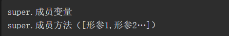

- Kotlin中所有类都继承Any类，它是所有类的父类，如果一个类在声明时没有指定父类，则默认父类为Any类，在程序运行时，Any类会自动映射为Java中的java.lang.Object类。

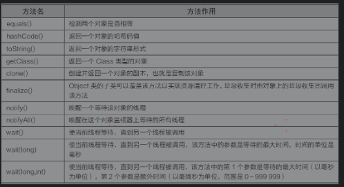

- 抽象方法使用abstract关键字修饰，该方法没有方法体，在使用时需要实现其方法体，当一个类中包含了抽象方法，该类必须使用abstract关键字定义为抽象类

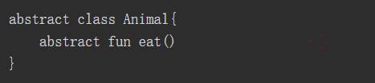

- 包含抽象方法的类必须声明为抽象类，但抽象类可以不包含任何抽象方法，只需使用abstract关键字来修饰即可
- 抽象类是不可以被实例化的，因为抽象类中有可能包含抽象方法，抽象方法是没有方法体的，不可以被调用

- 如果一个抽象类中的所有方法都是抽象的，则可以将这个类用另外一种方式来定义，即接口，使用interface关键字来声明

- 接口中的方法都是抽象的，不能实例化对象
- 当一个类实现接口时，如果这个类是抽象类，则实现接口中的部分方法即可，否则需要实现接口中的所有方法。
- 一个类通过冒号（:）实现接口时，可以实现多个接口，被实现的多个接口之间要用逗号隔开
- 一个接口可以通过冒号（:）继承多个接口，接口之间用逗号隔开
- 一个类在继承另一个类的同时还可以实现接口，继承的类和实现的接口都可以放在冒号（:）后面

### 常用类

- 嵌套类是指可以嵌套在其他类中的类，该类不能访问外部类的成员
- 内部类指的是可以用inner标记以便能够访问外部类的成员

- 在Java中，将一个类定义在另一个类的内部，则称这个类为成员内部类，如果成员内部类加上static修饰，则是称为静态内部类。Java中成员内部类中可以访问外部类的所有成员
- 在Kotlin中，将一个类定义在另一个类的内部，不加任何修饰符，则这个类将被默认为是一个嵌套类，如果加上inner修饰，则是一个内部类。Kotlin中的内部类可以访问外部类中的变量，而嵌套类却不可以访问

- 枚举类的前面用enum关键字来修饰

- 密封类是枚举类的扩展，即枚举类型的值集合，必须用sealed关键字来修饰，子类只能定义在密封类的内部或者同一个文件中

- 密封类适用于子类可数的情况，而枚举类适用于实例可数的情况

- 数据类用关键字data进行标记

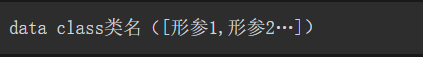

- 数据类的主构造函数至少有一个参数，如果需要一个无参的构造函数，可以将构造函数中的参数都设置为默认值。
- 数据类中的主构造函数中传递的参数必须用val或var来修饰。
- 数据类不可以用abstract、open、sealed或inner关键字来修饰。
- 在Kotlin 1.1版本之前数据类只能实现接口，1.1版本之后数据类可以继承其他类。
- 编译器可以自动生成一些常用方法，如equals()、hashCode()、toString()、componentN()、copy()等，这些方法也可以进行自定义

- 单例模式是通过object关键字来完成的，通过object修饰的类即为单例类，单例类在程序中有且仅有一个实例

- 定义伴生对象是通过“companion”关键字标识的，由于每个类中有且仅有一个伴生对象，因此也可以不指定伴生对象的名称，并且其他对象可以共享伴生对象

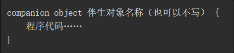

- 有名称：调用方式为“类名.伴生对象名.成员名”或“类名.成员名”
- 无名称：调用方式为“类名.Companion.成员名”或“类名.成员名

### 委托的使用与异常的处理

- 委托是通过by关键字实现

- 属性委托是指一个类的某个属性值不是在类中直接进行定义，而是将其委托给一个代理类，从而实现对该类的属性进行统一管理

- 注意：
setValue()方法和getValue()方法前必须使用operator关键字修饰；
getValue()方法的返回类型必须与委托属性相同或是其子类；
如果委托属性是只读属性，即val类型，则被委托类需要实现getValue()方法。如果委托属性是可变属性，即var类型，则被委托类需要实现getValue()方法和setValue()方法。

- 延迟加载是通过 “by lazy” 关键字标识，变量要求声明为 val，即不可变变量，延迟加载是委托的 一种形式。

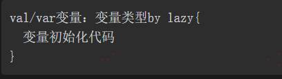

- 延迟加载的变量在第1次初始化时会输出代码块中的所有内容，之后在调用该变量时，都只会输出最后一行代码的内容

- ArithmeticException、ClassNotFoundException、ArrayIndexOutOfBoundsException、IllegalArgumentException 等异常类都是继承 java.lang.Throwable类

- 异常捕获通常使用try…catch语句来实现

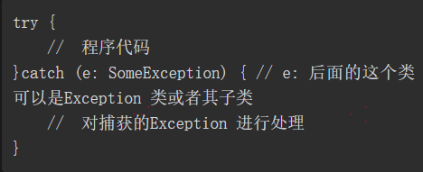

- try catch 添加 finally 语句，finally 中的语句都会执行，常用于 释放系统资源等必须要做的事情。注意当catch代码块中执行了System.exit（0）语句时，finally中的代码块就不会执行。System.exit（0）表示退出当前的程序，退出当前程序后，任何代码都不能再执行了

- 与Java不同的是，在try…catch…finally中，try是一个表达式，即它可以返回一个值，try表达式的返回值是try代码块中的最后一个表达式的结果或者是所有catch代码块中的最后一个表达式的结果，finally代码块中的内容不会影响表达式的结果。

- 在try…catch…finally语句中，catch代码块可以有多个也可以没有，finally代码块可以省略，但是catch和finally代码块至少应有一个是存在的。

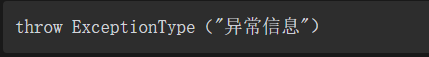

- Nothing是一个空类型（uninhabited type），也就是说在程序运行时不会出任何一个Nothing类型的对象，可以使用Nothing类型来标记一个永远不会有返回数据的函数

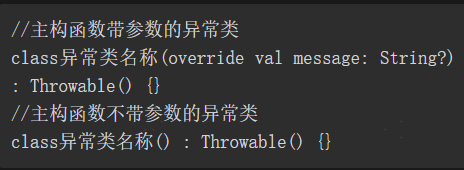

----------------------------------------------------------------------