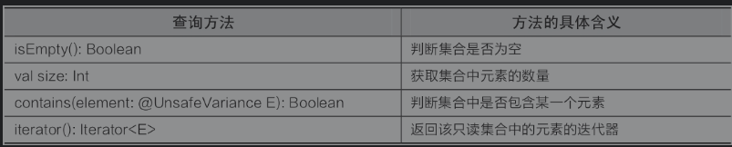

###常用集合类

- 单列集合 Collection：Iterable 是单列集合类的根接口
- Collection用于存储一系列符合规则的元素，它有3个重要的子接口，分别是List、Set和MutableCollection
- List 的特点是元素有序、元素可重复
- Set 的特点是元素无序并且不可重复
- MutableCollection 的特点是元素可变

- 图中虚线框标识的都是Java中的集合类，但是这些类可以在Kotlin中使用

- Collection是所有单列集合的父接口

- Map是双列集合类的根接口，用于存储具有键（Key）、值（Value）映射关系的元素，每个元素都包含一对键值，在使用Map集合时可以通过指定的Key找到对应的Value

###List接口的使用方法

- 有序、允许出现重复的元素
- 以一种线性方式存
- 可以通过索引来访问集合中的指定元素
- 可变集合MutableList可以对集合中的元素进行增加和删除的操作
- 不可变集合List对集合中的元素仅提供只读操作
- 尽可能多用不可变集合List，这样可以在一定程度上提高内存效率

- 不可变List是一个只读操作的集合，只有size属性和get()函数，继承自Collection进而继承自Iterable，通过listOf()函数创建

- containsAll（elements:Collection＜@UnsafeVariance E＞）方法判断一个集合中是否包含某个集合

- 可变集合MutableList＜E＞接口继承于List＜E＞接口和MutableCollection＜E＞接口，增加了对集合中元素的添加及删除的操作，使用mutableListOf()函数来创建对象

### Set接口的使用方法

- 无序，元素不可重复
- 可变集合MutableSet与不可变集合Set，可变集合MutableSet是对集合中的元素进行增加和删除的操作，不可变集合Set对集合中的元素仅提供只读的操作

- 批量操作的方法只有containsAll（elements:Collection＜@UnsafeVariance E＞），判断集合中是否包含某一个集合

- Set集合中也可以进行List集合中的索引操作和迭代器操作

- 可变MutableSet集合是使用mutableSetOf()函数来创建对象

###Map接口的使用方法

- Map接口是一种双列集合，它的每个元素都包含一个键对象Key和一个值对象Value，键和值对象之间存在一种对应关系，称为映射
- 无序可重复的，分为不可变集合Map和可变集合MutableMap两种
- 不可变Map集合的查询操作主要有判断集合是否为空、获取集合中元素的数量、判断集合中是否包含指定的键、判断集合中是否包含指定的值以及根据key（键）获取value（值）

- 可变MutableMap集合是使用mutableMapOf ()函数来创建

- MutableMap集合中的批量操作的方法有putAll（from:Map＜out K, V＞）和clear()， 含义分别是向集合中添加一个集合与清空集合中的映射

- 无论是Map还是MutableMap，获取到的键、值或者键/值对的Set都是只读的，即便是MutableMap获取的MutableSet也是只读的，因为在Map或者MutableMap中，将这些Set设置为只读常量。使用keySet()函数抽取key序列，将map中的所有keys生成一个Set。使用values()函数抽取value序列，将map中的所有values生成一个Collection。一个生成Set，另一个生成Collection的原因是key是独一无二的，而value允许重复。