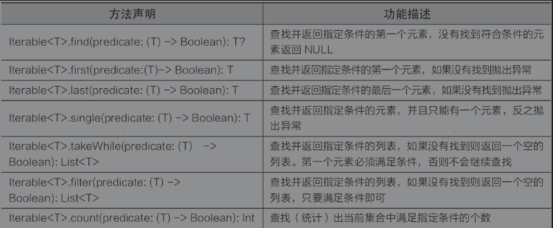
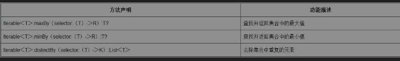

### Lambda表达式的使用方法

- Lambda表达式是一个匿名函数，是对匿名内部类的一种简化

- 无参数有返回值，只需要将函数体写在“{}”中，函数体可以是表达式或语句块

- “()”就代表了调用该表达式

- 有参数有返回值的Lambda表达式需要指定参数名称以及参数类型，参数之间使用英文“,”分隔，且参数类型可以省略，函数体会自动校对。“-＞”用于表示箭头，用于指定参数或数据的指向。

- 在开发中还可以将Lambda表达式赋值给一个变量，通过变量来直接调用

- 不要将不是返回值的语句放置在方法体的最后一条语句的位置

###高阶函数的概念与使用方法

- 如果函数只有一个参数，且这个参数类型是一个函数类型，则在调用函数时可以去掉函数名称后面的小括号

- 如果一个函数有多个参数，但是最后一个参数类型是函数类型，那么在调用函数时，可以将最后一个参数从括号中移出，并且去掉参数之间的符号“,”

- 无论函数包含多少个参数，如果其中有参数是函数类型，并且函数类型满足只接收一个参数的要求，可以用it关键字代替函数的形参以及箭头

- 函数不仅可以作为参数使用，还可以作为返回值使用

- find()方法用于查找并返回指定条件的第1个元素，没有找到符合条件的元素返回NULL
- first()方法用于查找并返回指定条件的第1个元素，last()方法用于查找并返回指定条件的最后1个元素，如果这两个方法在查找时没有找到匹配的元素，会在运行时抛出异常
- single()方法用于在当前的集合中查找满足指定条件的一个元素。需要注意的是，满足条件的元素只能有一个，多个或者没有都会抛出异常
- 使用takeWhile()方法查找多个满足条件的元素，当调用takeWhile()方法时，匹配条件必须是第1个元素满足条件才可以继续向下查找
- 使用filter()方法将满足条件的所有元素都输出
- count()方法用于查找满足于当前条件的元素个数

- maxBy()方法用于获取集合中的最大值，minBy()方法用于获取集合中最小值，distinctBy()方法用于去除集合中重复的元素

- repeat()函数用于重复执行某条语句
- T.run()函数：通过run()函数为ArrayList集合添加数据，此时可以省略当前的list对象， 调用run()函数时返回值为函数体的最后一条语句
- 通过使用return@run可以结束当前的run()函数
- 所有在Standard类中的方法都可以通过“return@方法名”这种格式结束当前方法

###内联函数的使用方法

- 被inline修饰的Lambda（函数）称为内联函数，使用内联函数可以降低程序的内存消耗，不要内联一个复杂功能的函数
- 通过noinline修饰的Lambda表达式是非内联关系，可以当作参数使用