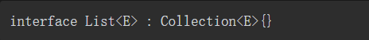

### 泛型的定义

- 泛型即“参数化类型”，就是将具体的类型变成参数化类型，在声明一个泛型时，传递的是一个类型形参，在调用时传递的是一个类型实参

- 泛型是在类型名之后、主构造函数之前用尖括号“＜＞”括起来的大写字母类型参数

### 泛型的分类

- 使用泛型标记的类，被称为泛型类。
- 当泛型类用于实例化时，需要传递具体的类型实参。
- 当泛型类被用于继承时，需要为泛型形参提供一个具体类型或者另一个类型的形参

- 使用泛型标记的接口，被称为泛型接口

- 泛型接口被实现时能够确定泛型接口对应的实参，直接传递实参即可

- 泛型接口被实现时不能够确定泛型接口对应的实参，则需要使用当前类或者接口的泛型形参

- 使用泛型标记的方法，被称为泛型方法

### 泛型的约束、子类与子类型

- 泛型约束是对类或者方法中的类型变量进行约束

- 泛型约束＜T:类或接口＞与Java中的＜? extends类或接口＞类似，这个约束也可以理解为泛型的上界
- 例如泛型约束＜T:BoundingType＞，其中BoundingType可以称为绑定类型，绑定类型可以是类或者接口。如果绑定类型是一个类，则类型参数T必须是BoundingType的子类。如果绑定类型是一个接口，则类型参数T必须是BoundingType接口的实现类
- 如果上界约束需要多个约束，则可以通过where语句来完成

- ＜T:Any?＞表示类型实参是Any的子类，且类型实参可以为null
- ＜T:Any＞表示类型实参是Any的子类，且类型实参不可以为null

- 子类是继承的概念，如果B继承A，则B就是A的子类。如果需要使用类型A的变量时，可以使用类型B的变量来代替，则此时类型B就是A的子类型。
- 子类与子类型是不同的，类中变量的替换原则只适合于子类型关系
- 子类说明是一个新类继承了父类，而子类型则是强调了新类具有父类一样的行为，这个行为不一定是继承

- 如果B类实现了接口A，则B类就是接口A的子类型

- 非空类型String是可空类型String?的子类型

- B是A的子类型，但Xxx＜B＞不是Xxx＜A＞的子类型

### 协变与逆变

- out关键字用于指定该类型参数是协变Covariant；in关键字用于指定该类型参数是逆变Contravariance

- 协变是将父类变为具体子类，协变类型作为消费者，只能读取不能写入，逆变是将子类变为具体父类，逆变作为生产者，只能写入不能读取

- B类是A类的子类型，默认情况下Xxx＜B＞不是Xxx＜A＞的子类型。但是通过out关键字可以使Xxx＜B＞是Xxx＜A＞的子类型，这样的操作叫作协变

- out关键字只能出现在泛型类或者泛型接口的泛型参数声明上，不能出现在泛型方法的泛型参数声明上
- out关键字修饰泛型类或者泛型接口的泛型参数时会支持协变

- in关键字与out关键字有相反的功能，可以使Xxx＜A＞不是Xxx＜B＞的子类型，这样的变化叫作逆变

- in关键字可以出现在泛型类型或者泛型接口的泛型参数声明上，不能出现在泛型方法的泛型参数声明上

- in关键字修饰泛型类或者泛型接口中的泛型参数时会支持逆变

- 泛型参数T在使用了in关键字之后，不能声明成val或者var类型的变量

- 除了在类或接口中定义泛型参数时使用out、in关键字之外，还可以在泛型参数出现的具体位置使用out、in关键字，这种变型被称为使用点变型

### 泛型擦除与实化类型

- 擦除是指当定义一个泛型时，例如List＜String＞类型，运行时它只是List，并不体现String类型

- 在Java程序中，如果不知道泛型的具体类型时，可以用“?”通配符来代替具体的类型，而在Kotlin中则使用“*”来代替泛型的具体类型，这个“*”就被称为泛型通配符，它只能在“＜＞”中使用

- 星投影就是将泛型中的“*”等价于泛型中的注解out与in对应的协变类型参数与逆变类型参数，泛型的每个具体实例化将是该投影的子类型

- 对于泛型类A＜out T＞，其中T是一个具有上界TUpper的协变类型参数，A＜*＞等价于A＜out TUpper＞，这意味着当T未知时，可以安全地从A＜*＞中读取TUpper的值。

- 对于泛型类A＜in T＞，其中T是一个逆变类型参数，A＜*＞等价于A＜in Nothing＞，由于Nothing类型表示没有任何值，因此这意味着当T未知时，没有安全的方式写入A＜*＞

- 对于泛型类A＜T＞，其中T是一个具有上界TUpper的不型变类型参数，A＜*＞在读取值时等价于A＜outTUpper＞，而在写值时等价于A＜in Nothing＞

- 如果泛型类型具有多个类型参数，则每个类型参数都可以进行单独的星投影，例如，如果声明一个泛型类B＜inT,out U＞，则此时可以根据星投影语法推测出以下星投影。
- 如果泛型类为B＜*, String＞，则该泛型类等价于B＜inNothing, String＞。
- 如果泛型类为B＜Int,*＞，则该泛型类等价于B＜Int, outAny?＞。
- 如果泛型类为B＜*,*＞，则该泛型类等价于B＜inNothing, out Any?＞。

- 在Java中，可以通过反射获取泛型的真实类型，而在Kotlin中，要想获取泛型的实参类型，则需要在内联函数（inline关键字定义的函数）中使用reified关键字修饰泛型参数才可以，这样的参数称为实化类型

- reified关键词必须要和inline一起使用，因为只有内联的泛型函数才可以在运行时获取泛型实参的类型