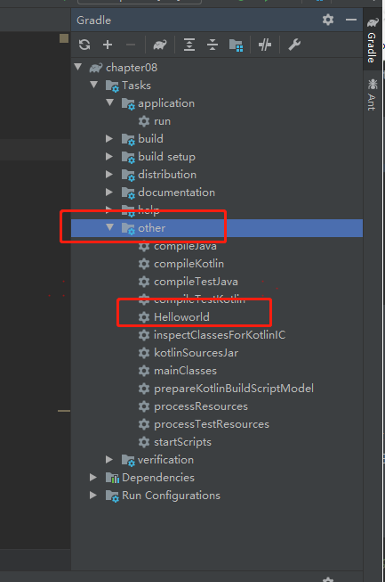
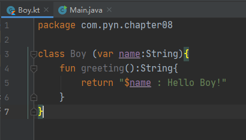

### Gradle项目的创建方法

- Ant工具：在2000年推出，是基于XML的构建工具，构建项目需要手动编写脚本

- Maven工具：在2007年推出，在Ant基础上增加了依赖管理

- Gradle工具：在2012年推出，在Maven基础上增加了DSL自定义扩展任务

- Gradle 默认使用 groovy 脚本构建，从Gradle 4.0开始，Gradle正式支持Kotlin语言的构建

- Gradle非常强大，可以构建任何项目，例如JavaEE、Android和前端等项目，并且还可以实现自动化构建和快速交付。

1. 创建Gradle程序

【File】→【New】→【Project】→【Gradle】 勾上【Java】

取名 →【Next】

2. 配置Gradle程序

- 如果使用的Gradle版本为4.0或者4.0以下，则后续程序中的build.gradle.kts文件中的application就容易报错，并且右侧的Gradle projects窗口中的Tasks文件夹中没有application文件夹
- Gradle版本最好是下载到本地再加载，不然Gradle的构建速度会比较慢（下载地址是“https://gradle.org/”，获取到对应的Gradle版本的压缩包后，接着将distributionUrl的值设置为如“File:///E:/tools/gradle-4.1-bin.zip”）
- Gradle 4.1的版本对应的jdk版本为1.8

默认IDEA使用的是groovy脚本构建的项目，将项目中的build.gradle文件重命名为build.gradle.kts。

mainClassName 对应的是程序入口类的绝对路径

3. 创建Gradle程序中的功能类

4. 运行Gradle程序

- Java代码与Kotlin代码共存

1. 配置build.gradle.kts文件

kotlin-stdlib.jar包是Kotlin的标准库
repositories用于声明仓库，从jcenter仓库中下载依赖
application中的mainClassName声明的是程序的入口，即为Main.java

2. 创建Boy.kt

### Gradle的任务

- Gradle本身的领域对象主要有Project和Task
- Project为Task提供执行的容器和上下文
- Project是Gradle的API中的一个接口，Gradle之所以可以工作，是因为在Gradle脚本中将代码以任务的方式插入到了Project中，Project执行这些任务，Gradle就开始工作了

1. 在build.gradle.kts中创建一个task

task()方法中接收了两个参数，第1个参数是表示任务task的名称，这个名称设置为Helloworld，第2个参数是一个闭包，这个闭包中编写的是Kotlin的代码，主要是实现任务的内容，这个任务的内容是打印一个“Hello World!!!”字符串

- 依赖管理是指如果一件事未完成，则下一件事就无法开始做，这两件事之间有依赖关系
- 依赖的关系在程序中是通过dependsOn()方法来实现

- Gradle任务的生命周期分为“扫描时”和“运行时”，扫描时任务的特点是扫描时所有任务都会执行，任务执行的先后顺序同build.gradle.kts文件中的任务代码顺序一致，哪个任务代码在前面就先执行哪个，与依赖顺序无关。如果想执行指定的任务，不执行其他无关的任务时，需要借助运行时任务来实现。运行时任务只在运行阶段执行，在扫描阶段不执行

- Gradle中的任务默认都是扫描时任务，如果想使用运行时任务，则需要添加doFirst()高阶函数来实现

- 扫描时的任务一般是用于声明程序中的变量，运行时的任务主要是用于执行程序中的业务逻辑

- tasks可以声明一个任务集，任务集可以将所有单独的任务放在一个集合中，便于管理多个任务

- properties是项目中所有默认属性组成的一个Map集合

- 增量式更新API：inputs表示输入，outputs表示输出
- 当编译源码时，输入的是src目录下的代码，输出的是编译生成的class文件。如果输入或者输出中有改变，才会执行updateTask任务

### Gradle的扩展与依赖管理

- 加个依赖，会把它依赖的依赖包自动添加到项目

- Maven Center 官网 http://mvnrepository.com/

- testcompile声明的是测试时依赖，测试时依赖只在测试阶段使用，在项目打包上线时不依赖，这样可以使项目的体积变小

- 扩展 Copy 任务，实现将 src 目录中的文件复制到 temp 目录中

- from()方法用于声明源目录，into()方法用于声明目标目录，如果目标目录不存在时，程序会自动创建这个目录

- 扩展Delete任务，实现删除temp目录

- 扩展Jar任务，将class文件生成Jar包并存放在temp目录

- include()方法主要用于设置文件的类型为class，将out/production/classes目录下的class文件生成my.jar包，并保存到temp目录下

- gradle可调用外部命令来操作Java的字节码文件

在“Gradle projects”窗口下方的other文件夹中，双击compileJava可以运行Hello类中的main()方法，运行成功之后，在项目的build/classes/java/main目录下可以看到生成的一个Hello.class字节码

将生成的Hello.class文件复制到当前的工程目录中，也就是与build.gradle.kts文件在同一个目录中，接着只需要修改build.gradle.kts文件中的内容就可以运行该字节码文件

Javaexec表示执行一个Java命令，main表示要执行的类的名称Hello，classpath表示字节码文件所在的目录，classpass()方法中的参数"."表示字节码文件的位置在当前的工程目录中