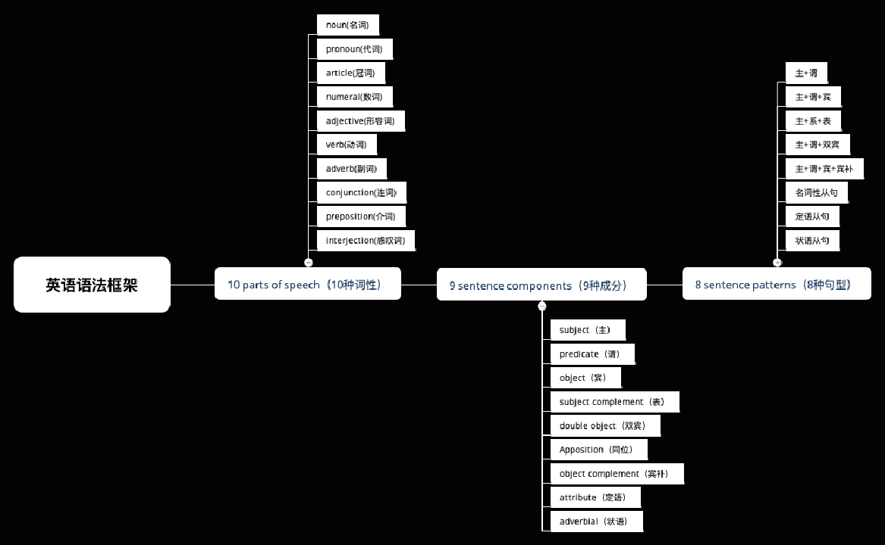

立 Flag 啦！重学英语语法，推荐 B 站，这是个好地方，找到一份不错的介绍语法视频，不过视频内容有点快，基本上就是过一遍语法，总结还是不错的。

好了，跟着up主去恶补语法吧！

本篇是框架，小本本记起来。O(∩_∩)O

### 一、10 种词性

注意很多单词有很多个词性，会在不同情况下使用不同词性。

- **1、noun（名词） n.**   —— 词类的一种，属于[实词](https://baike.baidu.com/item/%E5%AE%9E%E8%AF%8D/4430789)。它表示人、事、物、地点或 [抽象](https://baike.baidu.com/item/%E6%8A%BD%E8%B1%A1/9021828) 概念的统一名称。它分为 [专有名词](https://baike.baidu.com/item/%E4%B8%93%E6%9C%89%E5%90%8D%E8%AF%8D/3543467) 和普通名词。

比如 apple、cat、China

- **2、pronoun（代词）pron.**  —— 代替名词或一句话的一种词类。

 比如 we、that、all、who

- **3、numeral（数词）num.** —— 指表示数目多少或顺序多少的词。

比如 one、two、three

- **4、article（冠词）art.** —— 虚词，在句子中一般不重读，本身不能独立使用，只能与名词放在一起（一般用于名词之前 ）帮助说明名词所指的人或事物。

比如 a、an、the

- **5、verb（动词）v.** —— 一般用来表示 [动作](https://baike.baidu.com/item/%E5%8A%A8%E4%BD%9C/33802) 或 [状态](https://baike.baidu.com/item/%E7%8A%B6%E6%80%81/33204) 的词汇。

比如 get、do、play

- **6、adverb（副词）adv.** —— 指在句子中表示行为或状态特征的词，用以修饰动词、形容词、其他副词或全句，表示时间、地点、程度、方式等概念。

 比如 next、much、back

- **7、adjective（形容词）adj.** —— 用来描写或修饰名词或代词。

 比如 good、fast、hot

- **8、preposition（介词）prep.** —— 也叫前置词，表示名词、代词等与句中其它词的关系，在句中不能单独作句子成分，没什么实际意义。

 比如 at、in、on

- **9、conjunction（连词）conj.** ——用来连接词与词、词组与词组或句子与句子、表示某种逻辑关系的虚词。

 比如 and、also、but

- **10、interjection（感叹词）int.** —— 表示说话时喜悦、惊讶等情感的词就是感叹词。一般用在句子的前面或者后面，没什么语法内容。

 比如 what、yum、blah

**注意**：背单词最好把单词的词性背下来

### 二、9 种成分：

- **subject（主语）**—— 执行句子的行为或动作的主体。

- **attribute（定语）**—— 指名词性偏正短语里的修饰语。

- **subject complement（表语）**—— 属于主语补足语，常由名词、形容词、介词短语、动名词、不定式、来充当，它常位于系动词（be）之后。

- **predicate（谓语）**—— 对主语加以陈述的成分。

- **adverbial（状语）**—— 谓语里的另一个附加成分。

- **double object（双宾）**—— 动词之后先后出现近宾语、远宾语两层宾语的句子叫双宾句。

- **object（宾语）**—— 也称受词，是指一个动作（动词）的接受者。

- **object complement（宾补）**—— 在英语中有些及物动词，接了宾语意义仍不完整，还需要有一个其他的句子成分，来补充说明宾语的意义、状态等。

- **Apposition（同位）** —— 一个名词（或其它形式）对另一个名词或代词进行解释或补充说明。

### 三、8 种句型：

简单句：

- 主+谓

- 主+谓+宾

- 主+谓+表

- 主+谓+双宾

- 主+谓+宾补

### 四、复合句：

- 名词性从句

- 定语从句

- 状语从句

----

附 PPT 语法框架图：

>

>B站地址：https://www.bilibili.com/video/av66639463?from=search&seid=1334602665489481901