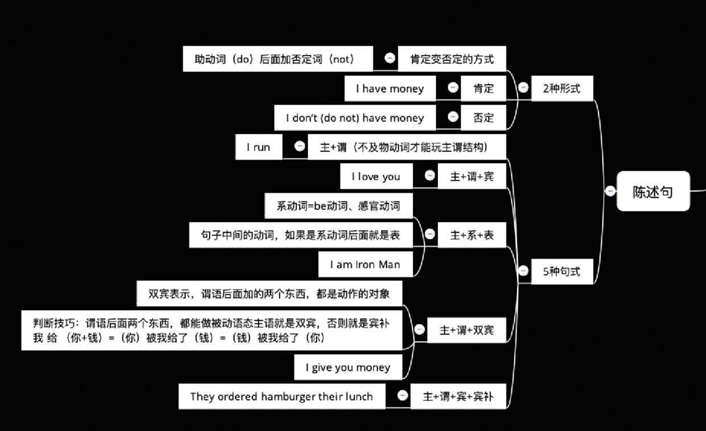
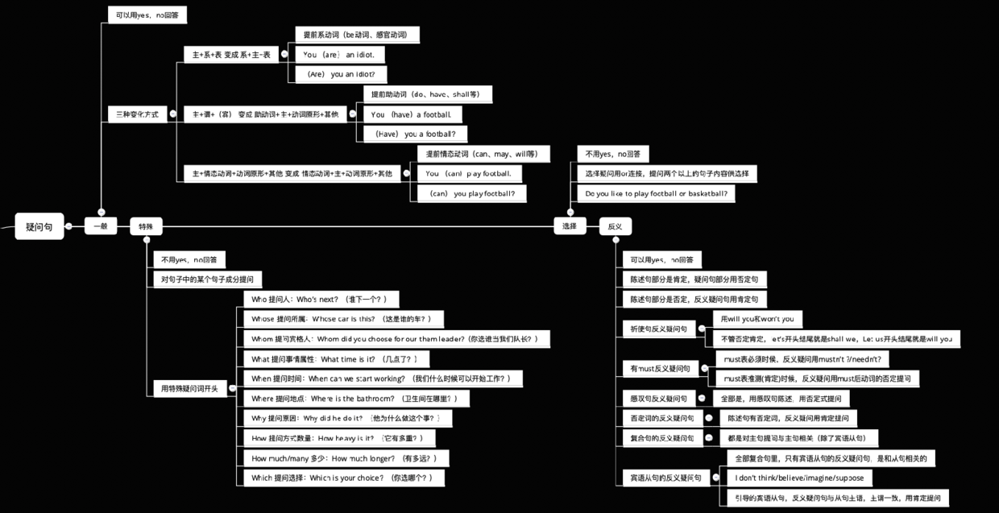
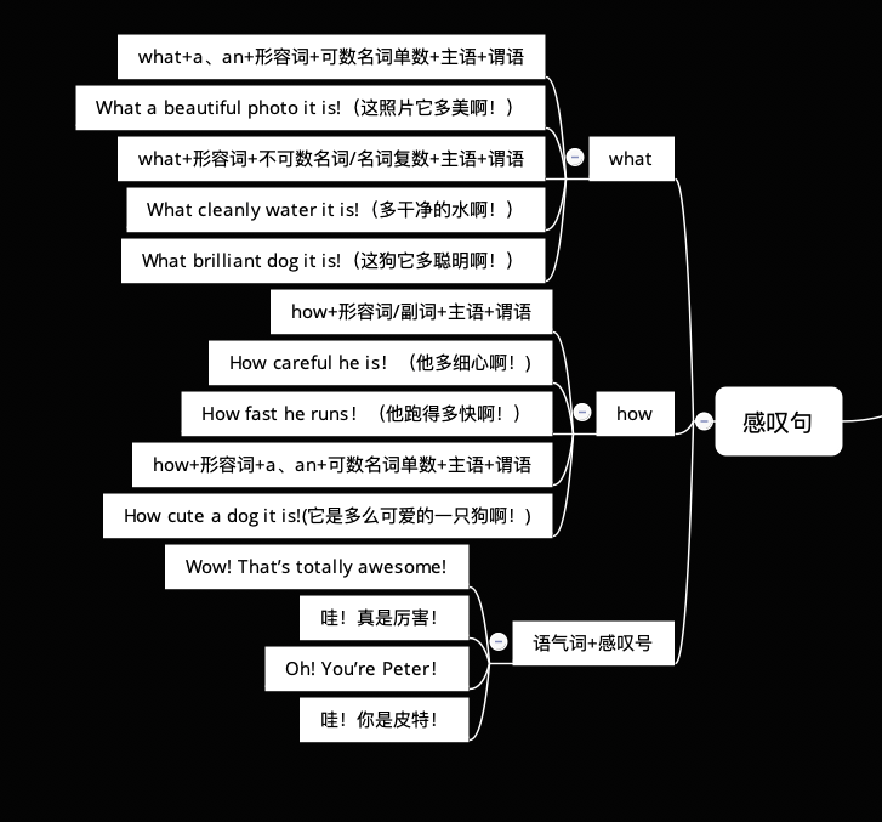
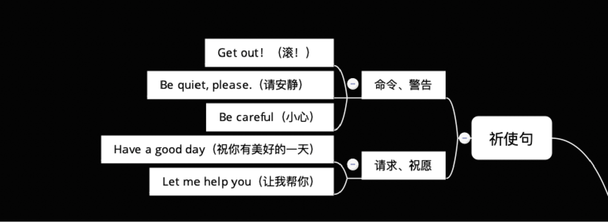

# 简单句分类（四类）

## 1、陈述句

陈述一个事实或者说话人的看法的句型。

### 1.1、两种形式

##### 肯定式：

例如： I have money

##### 否定式： （肯定变否定的方式，助动词（do）后面加否定词（not））

例如： I don’t （do not）have money

### 1.2、五种句型

##### 1.2.1、主+谓（不及物动词才能玩主谓结构）

例如：I run

##### 1.2.2、主+谓+宾

例如：I love you

##### 1.2.3、主+系+表

例如：I am Iron Man

系动词 = be动词（am is are 等等）+ 感官动词（看、听、闻、尝、感觉、变得、似乎、保持、证明）

句子中间的谓语动词，如果在系动词后面就是表语。

##### 1.2.4、主+谓+双宾（直接宾语+间接宾语）

例如：I give you money

双宾表示，谓语后面加的两个东西，都是动作的对象

我 给 （你+钱）

判断技巧：谓语后面两个东西，都能做被动语态主语就是双宾，否则就是宾补

我 给 （你+钱）=（你）被我给了（钱）=（钱）被我给了（你）

##### 1.2.5、主+谓+宾补

例如：They ordered hamburger their lunch

他们 点了 汉堡 他们的午餐

中文语序：他们的午餐他们点了汉堡

**判断技巧**：谓语后面两个东西，都能做被动语态主语就是双宾，否则就是宾补

他们 点了 （汉堡+他们的午餐）

（汉堡）被他们点了（他们的午餐），说不通了，汉堡被点了他们的午餐，汉堡成仙了？还要被人点菜给汉堡吃？

（他们的午餐）被他们点了（汉堡），可以说通，他们的午餐被点了汉堡

## 2、疑问句

主要交际功能是提出问题，询问情况。

#### 2.1、一般疑问（Do you love me？）

可以用 yes，no 回答

- **陈述句变一般疑问句三种方式之：提前系动词（be动词、感官动词）**

**主+系+表  ——>  系+主+表**

陈述句：You （are） an idiot. （你是个笨蛋）

一般疑问句:（Are） you an idiot？（你是不是个笨蛋？）

回答：Yes, I am/No, I’m not.

- **陈述句变一般疑问句三种方式之：提前助动词（do、have、shall等）**

**主+谓+（宾） ——> 助动词+主+动词原形+其他**

陈述句：You （have） got light bulbs. (你有灯泡)       

一般疑问句: （Have） you got light bulbs？（你有灯泡吗？）

回答：Yes, I have/No, I haven’t

- **陈述句变一般疑问句三种方式之：提前情态动词（can、may、will等）**

**主+情态动词+动词原形+其他 ——> 情态动词+主+动词原形+其他**

陈述句：You （can）play football. (你会踢足球)       

一般疑问句:（can） you play football？（你会踢足球吗？）

回答：Yes, I can/No, I can’t

#### 2.2、特殊疑问（Why do you love me？）

- **不可以用 yes，no 回答**
- **对句子中的某个句子成分提问**
- **用特殊疑问词开头。**

Who 提问人：Who’s next？（谁下一个？）

Whose 提问所属：Whose car is this？（这是谁的车？）

Whom 提问宾格人：Whom did you choose for our them leader?
（你选谁当我们队长？）

What 提问事情属性：What time is it？（几点了？）

When 提问时间：When can we start working？（我们什么时候可以开始工作？）

Where 提问地点：Where is the bathroom？（卫生间在哪里？）

Why 提问原因：Why did he do it？（他为什么做这个事？）

How 提问方式数量：How heavy is it？（它有多重？）

How much/many 多少：How much longer？（有多远？）

Which 提问选择：Which is your choice？（你选哪个？）

#### 2.3、选择疑问（Do you love my body or my heart？）

- **不可以用yes，no回答**
- **选择疑问用or连接**
- **提问两个以上的句子内容供选择**

Do you like to play football or basketball?
你喜欢踢球还是打篮球？
回答：I like to play football/I like to play basketball

#### 2.4、反义疑问句（You love me，Don’t you？）

- **可以用yes，no回答**
- **前肯后否，前否后肯**

陈述句部分是肯定，疑问句部分用否定句
He is your teacher, isn‘t he？(他是你的老师，不是吗？)

陈述句部分是否定，反义疑问句用肯定句
He isn‘t your teacher, is he？(他不是你的老师，是吗？)

根据事实回答：Yes, he is/No, he isn’t

**2.4.1 祈使句反义疑问句：**

- **用 will you 和 won’t you**

Open the door, won’t you?
打开开门，不好吗？

Don’t open the door, will you?
不打开门，好吗？

- **不管否定肯定，let’s 开头结尾就是 shall we，Let us 开头结尾就是 will you**

肯定：Let‘s go to school, shall we? Let us go outside, will you?
否定：Let‘s don’t go out, shall we? Don't let us go there, will you?

**2.4.2 有 must 反义疑问句**

- **must 表必须时候，反义疑问用 mustn’t ?/needn’t?**

He must study hard at English, mustn't he？
他必须努力学英语，不是吗？

- **must 表推测（肯定）时候，反义疑问用 must 后动词的否定提问**

You must be joking, aren't you？
你肯定是在开玩笑，不是吗？

**2.4.3 感叹句反义疑问句**

全部是，用感叹句陈述，用否定式提问，前肯后否

What a lovely girl, isn’t she?
多么可爱的女孩，不是吗？

**2.4.4 否定词的反义疑问句**

常见否定词 hardly, never, seldom, little, few, nowhere, nothing

陈述句有否定词，反义疑问用肯定提问

He hardly goes to school, does he?
他几乎不去学校，是吗？

**2.4.5 宾语从句的反义疑问句**

全部复合句里，只有宾语从句的反义疑问句，是和从句相关的。

I don’t think/believe/imagine/suppose
引导的宾语从句，反义疑问句与从句主语，主谓一致，用肯定提问

I don’t imagine he has got it, has he?
我没有想过他有它，他有吗？

## 3、感叹句

表示喜怒哀乐等强烈情感的句子。

#### 3.1、What感叹句

what+a、an + 形容词 + 可数名词单数 + 主语 + 谓语

What a beautiful photo it is !（这照片它多美啊！）

what + 形容词 + 不可数名词/名词复数 + 主语 + 谓语

What cleanly water it is !（多干净的水啊！）
What brilliant dogs they are !（多聪明的狗啊！）

#### 3.2、How感叹句

how + 形容词/副词 + 主语 + 谓语 

How careful he is ！（他多细心啊！)
How fast he runs ！（他跑得多快啊！）

how + 形容词 + a、an + 可数名词单数 + 主语 + 谓语

How cute a dog it is !(它是多么可爱的一只狗啊！)

#### 3.3、语气词 + 感叹号的感叹句

Wow ! That’s totally awesome !
哇！真是厉害！

Oh ! You’re Peter ！
哇！你是皮特！

## 4、祈使句

表示要对方做或不做某事、带有祈使语气的句子。

#### 4.1、命令、警告祈使句

Get out！（滚！） 
Be quiet, please.（请安静）  
Be careful（小心）

#### 4.2、请求、祝愿祈使句

Have a good day（祝你有美好的一天）
Let me help you（让我帮你）

## 总结图

>参考：https://www.bilibili.com/video/BV1Z4411C7jG?p=3