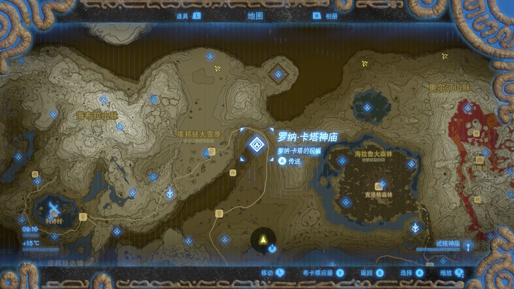

玩了好几月的塞尔达了，终于终于，把120个神庙找完啦，大功告成了一半，接下来任务，应该就是去找呀哈哈了吧~嗷嗷~还有迷你挑战呢，回忆录也还没找完，“我”现在还是失忆状态的林克呢。

哈？为啥不去城堡打Boss？emmm~ 作为手残党一族，怎么滴，也要先把能点满的技能都点满，背包装的满满当当的补给，身上穿的也是满级服装，带满高级武器装备去打 Boss 吧，只有这样，令人更有安全感。可是如果啥都点满了，去找 Boss 干架，还是一死，那么...那么...害~ 惨淡人生。

塞尔达最大的乐趣，本也不在于打 Boss, Boss 就在城堡里，从新手村出来就可以直冲城堡向大boss发起攻击了，前提是你有胆有身手。（听很多人说，打完盖侬无比后悔，哈哈哈，那，那，我慢点去打，不急不急，公主不在乎多等我一会儿）

B站上有个世界纪录28分56秒通关塞尔达，屌屌的，评论也是极有意思。

>

>

>

>

不得不说，真叼！有兴趣看的话附链接了！

>https://www.bilibili.com/video/BV1L4411j7PX?from=search&seid=6256763965000138417

不过我还是喜欢在赛达尔的世界里闲逛，杀杀猪，打打猎，煮个菜，滑个雪，抓个鱼，爬下树，射下龙，砍下矿石......好多事可以做，悠闲、自在。还可以各种摆拍，景色很美，很有意思。

喜欢塞尔达的世界，找齐120个神庙后，我来到了地图左上角的忘却神殿的大女神像面前，领取了绿油油荒野经典套装，它的效果是增加大师剑远程气刃伤害，穿上，准备准备，去营救塞尔达公主👸

>

附地图：
>