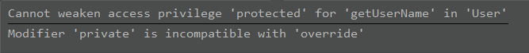
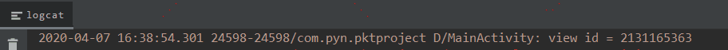

## Kotlin 的变量、函数和类型

>https://kaixue.io/kotlin-basic-1/

## 思考题

#### 1. 子类重写父类的 override 函数，能否修改它的可见性？

emmm，先看看可见性修饰符是哪些吧~
<br/><br/>

|    修饰符    |    类成员    |   顶层声明   |
| :----------: | :----------: | :----------: |
| public(默认) | 所有地方可见 | 所有地方可见 |
|   internal   |  模块内可见  |  模块内可见  |
|  protected   |  子类中可见  |     ---      |
|   private    |   类中可见   |  文件中可见  |

就这么四种可见性，经过真正的尝试，是可以将子类的可见性放开的，比如就是说，父类的可见性是 protected，子类同样可以是  protected，或者改写成 public，这种放开，如果子类可见性修改成 private，则编译器直接报错，如下所示：



所以子类权限是可以放开变大的，这也可以说是可以修改一下可见性不？先打个问号吧。或许可以叫有限制的修改可见性。

#### 2. 以下的写法有什么区别？

- **2.1 activity as? NewActivity**

如果 activity 是 NewActivity，转换成功，否则返回空，当 activity 为空的时候，返回也是为 null 。

- **2.2 activity as NewActivity?**

如果 activity 是NewActivity 类型，就转换成功，否则抛出 java.lang.ClassCastException 异常。当 activity 为 null 的时候，不会抛出异常，返回 null。

- **2.3 activity as? NewActivity?**

如果 activity 是 NewActivity 类型，就转换成功，否则返回空。

as 是强转关键字，如果强转类型操作是正确当然没问题，但如果强转成一个错误的类型，程序就会抛出一个异常。需要进行安全的强转，Kotlin 在设计上考虑到了优雅的处理强转出错的情况，就是使用 as? 来解决。强转后可能是一个可空类型的对象，然后再理解一下上述思考题的结论。

## 练习题

#### 1. 使用 Android Studio 创建一个基于 Kotlin 的新项目（Empty Activity），添加一个新的属性（类型是非空的 View），在 onCreate 函数中初始化它。

```
class NewActivity : AppCompatActivity() {

    lateinit var view: View

    override fun onCreate(savedInstanceState: Bundle?) {
        super.onCreate(savedInstanceState)
        setContentView(R.layout.activity_new)
        
        view = findViewById(R.id.view)
    }
}
```

#### 2. 声明一个参数为 View? 类型的方法，传入刚才的 View 类型属性，并在该方法中打印出该 View? 的 id。

```
class MainActivity : AppCompatActivity() {

    var view: View? = null

    override fun onCreate(savedInstanceState: Bundle?) {
        super.onCreate(savedInstanceState)
        setContentView(R.layout.activity_new)

        view = findViewById(R.id.view)
        Log.d("MainActivity", "view id = " + view!!.id)
    }
}
```
打印结果：<br><br>