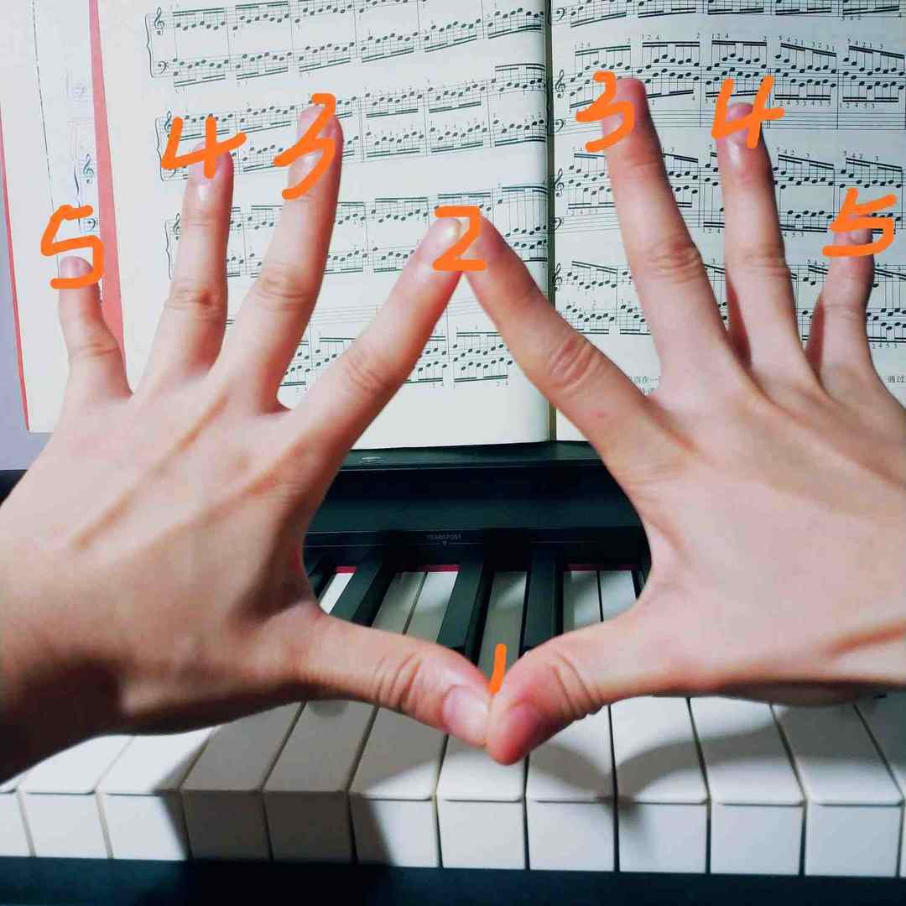
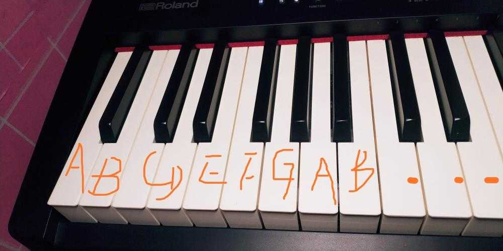
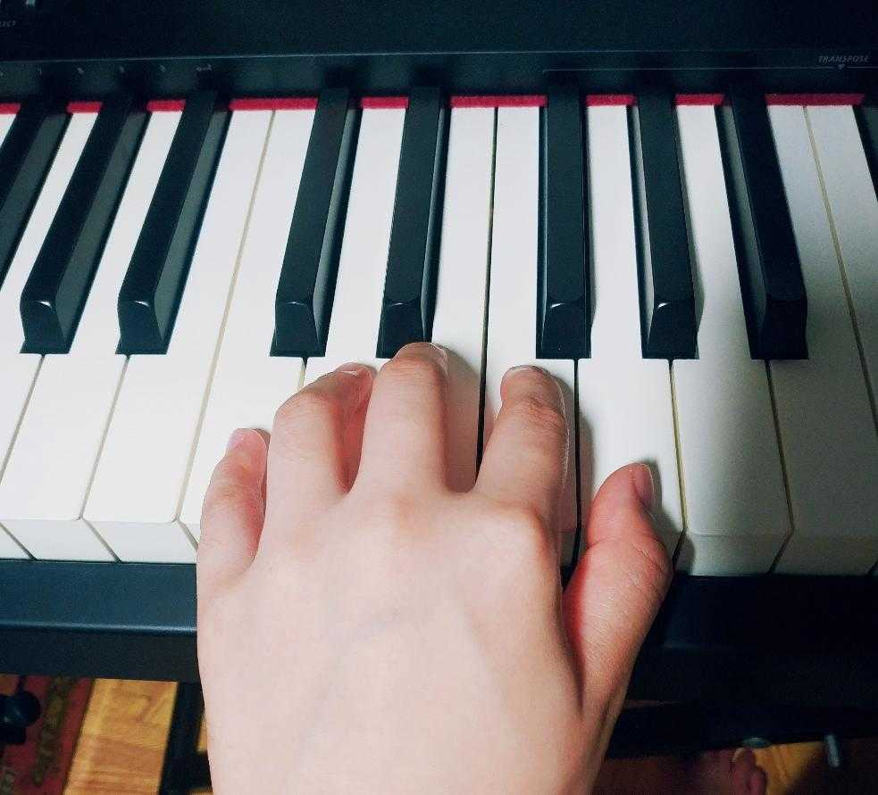

学钢琴嘛，益处多多，比如锻炼大脑，让大脑更灵活啊，更聪明啊，改善并增强大脑的神经连接啊，等等等。
不啰嗦，正文开始。

### 1. 指法

即手指标记。

我们的手指被标记为不同的数字，主要是为了方便我们识谱的时候知道应该用哪根手指来弹奏对应的琴键。

>

有些新手谱子上有些小数字，这个数字就是告诉我们，应该用哪根手指弹奏当前琴键，当然指法也不是固定的，我们会遵循一定的规则，也允许按照自己的一些习惯来。

**注意，** 弹奏音阶的时候，都是由左至右的弹，不要被手指标记的数字给搞混乱了。

### 2. 琴键

琴键是由七个音名循环组成，这里音名取名于英文字母表，叫 ABCDEFG，钢琴由 88 个琴键组成， 钢琴左边第一个键便是A，循环下去，最后一个键是 C。

由于黑键的存在，我们能够很快的识别琴键的音名。

>

- 钢琴的 88 个键，包括 52 个白键，36 个黑键。
- 黑键的意义：把琴键分成不同的组，（两黑键 + 三黑键一起，这是一组）总共有 7 个组，其中最中央的 C 键被成为中央 C（第 4 组上的 C）。

**快速识别琴键：**

- 两块黑键左侧是 C
- 三块黑键中间黑键的右侧白键是 A
- F 在三块黑键的左侧
- E 有两个 B有三个
- D 两块黑键的正中间（想象躺在两块水坝中间，这种就是D）

总之，音调都是在不断的重复的过程，一组一组的重复。

### 3. 手指

自然放松的半圆状态，演奏的声音的大小取决于弹下去的速度，通过练习可以变得熟练，放松，自然的状态，正确的手势和地板大致平行，手指是一座拱桥，想象手指轻如羽毛。

>

新手弹奏很容易折指，也比较僵硬，小指以及无名指比较无力，不过没关系，多练习就OK啦。记得要放松！

### 4. 弹奏 C 大调音阶

C 大调音阶弹奏，就是从 C 开始，以 C 结尾。（我们小时候学习的 1 2 3 4 5 6 7 1，念 dou rui mi fa suo la si dou）

由于我们只有五个手指头~因此要用一只手弹个完整的一个音阶，就需要运用到了穿指和跨指啦。如图：

右手也是一样的：

>>弹接下来就是学习弹奏《小星星》了，1 1 5 5 6 6 5  |  4 4 3 3 2 2 1  | 5 5 4 4 3 3 2 | 5 5 4 4 3 3 2 | 1 1 5 5 6 6 5 | 4 4 3 3 2 2 1 |   ，根据小时候学的一点简谱，也是可以的，弹出来还是挺好玩的。

### 5. 最后的分享总结：

在钢琴中，一首曲子其实就是由许多技巧知识融合在一起，如果你是懂这些知识，知道怎么弹和弦，那么你就可以弹这些曲子了，歌曲就是由这些东西组成的。然后你可以练习这些知识，靠自己去学会任何喜欢的曲子，通过这样的方式感受音乐的乐趣，享受音乐。
Andrew Furmanczyk  讲课真的挺幽默的，秒懂他讲的东西，真是不错的教学视频，强烈推荐。

>>B站链接：https://www.bilibili.com/video/BV1xb411T7Eb?p=4

>>油管链接：https://www.youtube.com/c/pianolounge/playlists

### 6.尾声的自言自语

算算日子，已是三年前了，那个时候做了个决定，报了个成人钢琴课，学习弹钢琴，虽说成人钢琴班还是有点水的（也许也是我报的那个地方比较水），教的都很随意，认认五线谱，简单的教下怎么弹那自制教材上的几首曲子，以至于我现在对于乐理知识还是一窍不通的，曲子嘛，死练会了几首。

现在立个 Flag，还是要系统学点乐理知识，还是从钢琴教学开始，去学习一份完善的教程课。有个很棒的钢琴教学视频课，《Andrew Furmanczyk 钢琴教学》，B 站上有 up 主上传了中文字幕的视频，真是良心 up 主，很赞。

好好加油学习吧！