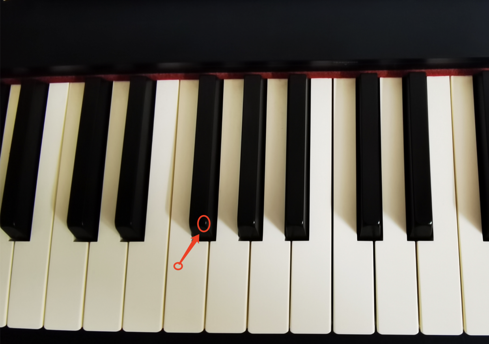
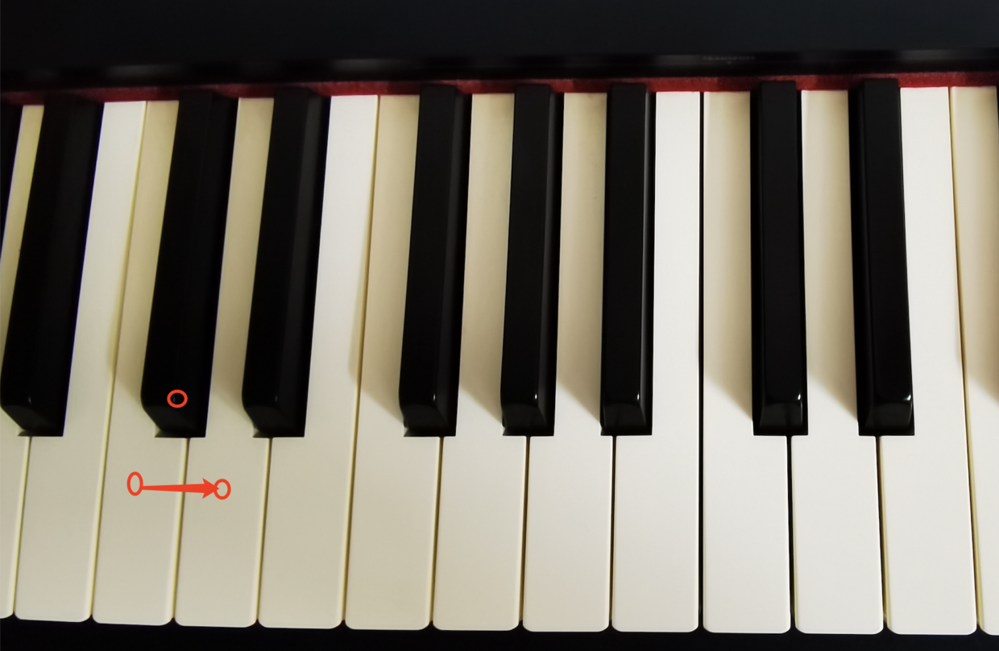
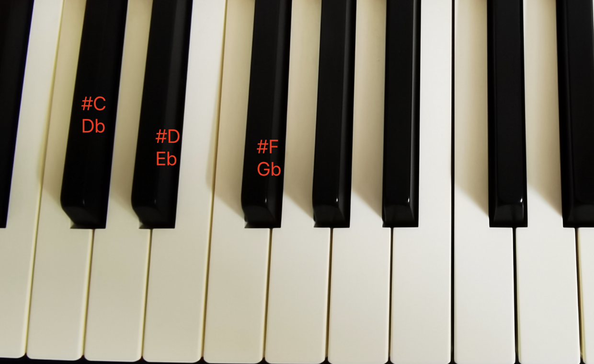
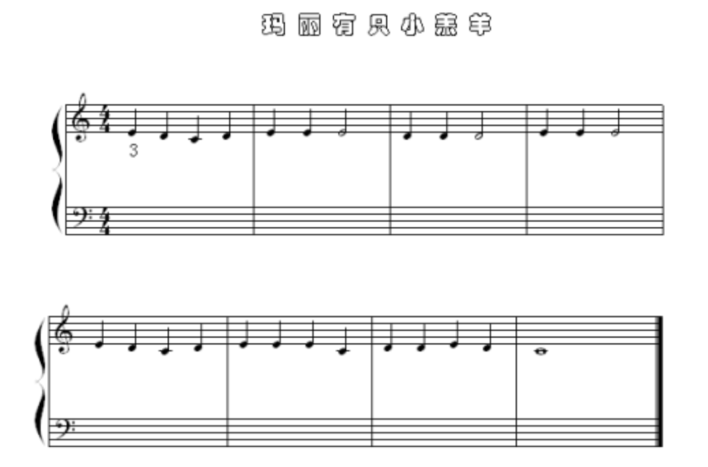

> ### 1. 半音与全音
>
> 小插曲：学习它们将会为你打开音乐的大门，独立去学曲子，弹奏曲子，要学会噢！
>
> 现在开始，我们可以把半音和全新想象成一条很长的链条，先自己去感受下，按着顺序弹奏一段音阶（包括黑键），仔细听，听起来就是一种向上的爬音。（有琴的就自己弹一下听着，不然听听视频中的也行，这需要切实感受一下更形象点）
>
> **半音** ———— 相邻的两个音。（从一个弹到下一个，就是弹的一个半音，包括黑键）
> >
>
> **全音** ———— 其实就是两个半音。（可以想象弹奏过程中，跳过了一个中间件，就是弹奏了一个全音）
>
> >
>
> 明白了全音和半音的概念后呢，就可以通过全音和半音去学习任何大调音阶了。
>
> 音阶概念呢，它是由一组音符组成，比如我们小时候学弹 1 2 3 4 5 6 7 1 ，这么弹下来，即一组大调音阶。
>
> 大调音阶可以从任何音符开始，它们都遵循相同的模式。
>
> **大调音阶：全全半全全全半。** (遵循这个模式弹出来的一组音符音阶，即为大调音阶)
>
> 每弹一个完整的大调或小调音阶呢，弹奏的第一个音符被叫作主音或者这个音阶的主调。
>
> 我们常常弹的都是从1开始，音名就是C，也叫C大调，以C为主调。
>
> **总之，** 每个音阶都有自己的主调，基本上它就是一堆和谐的音符。
>
> ### 2.升降调
>
> 升降调可以看作是 **对音符音高的转换**，可以将音符升高半音，也可以降低半音，升调向右，降调向左，比如升D就是将D升半个音，降D就是将D音降半个音。
>
> **异名同音** —— 同个音高的两种不同叫法，降D的异名同音是升C，弹奏的是同一个键。
>
> >
>
> 升降调的意义在于，通过它，可以对音调进行不同的改变，比如说弹奏G大调音阶，不是从G直接只按白键到下一个G，而是需要弹奏升F键，当然还有黑键的命名，我们也不能用一堆I,J,K那么多字母去命名黑键，升降音就变得有意义起来了。
>
> ### 3.音程
>
> **定义：** 两个音之间的距离
>
> 从C到下一个C或者从D到下一个D，它们全部被叫作 **纯八度**，刚刚好是一个八度，也就是从相同音符到下一个相同音符的距离。
>
> >
>
> 标准钢琴上有七个八度。
>
> **二度** —— 第一个音和第二个音，其实就是个全音。
>
> **三度** —— 第一个音和第三个音。
>
> 依此类推...
>
> **小技巧，** 看乐谱通过音程来阅读，会更快一点，不过也是需要多加练习的，形成一种肌肉记忆。
>
> ---
>
> 附：《玛丽有只小羔羊》五线谱
>
> >>
>
> >> 参考链接: https://www.bilibili.com/video/BV1xb411T7Eb?p=5